# REVO Scout — LAB Teleop Stack

The on-robot Python package that drives a **REVO Scout** (Segway-based semi-autonomous robot) from a browser dashboard at `streams.revobots.ai`. Owns motion, cameras, PTZ, lights, audio, GPS/RTK, lidar, session recording, telemetry, and ACT-based imitation learning integration.

- **Repo package:** `LAB/`
- **Author:** Aadi (Aditya Raj) — founding AI engineer, Revobots
- **Runtime:** Jetson Orin NX on the robot, Docker (`segway_ros1`) for motion, Tailscale for transport

---

## 1. Overall Architecture

Three independent transport channels split responsibilities cleanly by cadence and criticality:

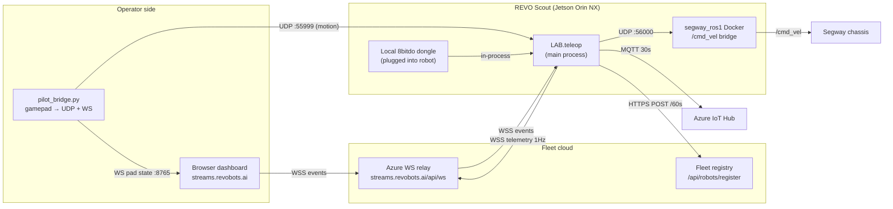

**Channel roles:**

| Channel | Transport | Owns | Cadence |
|---|---|---|---|
| **A — Control plane** | WSS relay | `lock`, `AI`, `bubble`, `xwalk`, `yield`, turn signals, `head`, `speed_mode`, `volume`, `tts`, `ttd` | event-driven |
| **B — Motion plane** | Direct UDP :55999 | `lin_x`, `ang_z`, `brake`, `head` | 50 Hz |
| **C — Fleet registration** | HTTPS POST | `robot_id`, `tailscale_ip`, `cameras` | 60 s |

Motion goes **direct** operator→robot over Tailscale (no cloud hop). Events go **through the relay** so the fleet can enforce a singleton per `robot_id`. Silence on the UDP channel triggers a brake-in-place watchdog but does **not** touch lock — lock is WS-authoritative.

---

## 2. File Layout

### On the robot: `LAB/`

| File | Purpose |
|---|---|
| `teleop.py` | Main entry. Wires all subsystems, hosts three dispatchers (UDP motion, WS events, local dongle events). |
| `config.py` | `LabConfig` dataclass. Loads secrets and `robot_id` from `.env`. |
| `common.py` | Utilities: `log()`, `now_mono()`, `truthy()`, `first_float()`. |
| `bridge_ws.py` | Outbound WSS client to the fleet relay. Exponential backoff reconnect. |
| `heartbeat.py` | HTTPS POST to fleet registry every 60 s. |
| `motion.py` | UDP forward to Segway Docker. Human/AI arbitration + lidar gate + watchdog. |
| `lights.py` | 4-channel USB HID relay board driver. Precedence-based blink loop. |
| `ptz.py` | ONVIF PTZ camera. Continuous move + dead-reckoned home capture/return. |
| `audio.py` | Piper TTS + music playback via `paplay`. PulseAudio sink management. |
| `cameras.py` | USB capture + in-process `GstRtspServer` on :8556 (RTSP passthrough + USB appsrc). |
| `sensors.py` | GPS reader (UDP from `gps_mux`), TempHum (USB HID), Battery (`docker exec` streaming). |
| `lidar.py` | Slamtec RPLIDAR S2 UART driver + sector bubble detection. |
| `record.py` | Session recorder: MP4 (nvenc or libx264) + JSONL telemetry + session.json. |
| `azure_telemetry.py` | Dashboard snapshots (1 Hz WSS) + Azure IoT Hub (30 s MQTT via DPS). |
| `local_gamepad.py` | Physical 8bitdo dongle on the robot. In-process dispatch to teleop callbacks. |

### On the operator PC: `LAB/pilot/`

| File | Purpose |
|---|---|
| `pilot_bridge.py` | Reads Xbox / 8bitdo pad via pygame. Serves W3C gamepad state to browser over `ws://127.0.0.1:8765`. Sends UDP :55999 motion. |

### Utilities: `LAB/utils/`

| File | Purpose |
|---|---|
| `gps_mux.py` | Owns `/dev/um982_gps`. Fans NMEA to a PTY (for Polaris RTK) and UDP :57002 (for `GpsReader`). |
| `gps_rtk.sh` | Supervisor script — runs `gps_mux` + Polaris RTK client together. |

### Shell orchestration

| File | Purpose |
|---|---|
| `ros_start.sh` | Brings up the `segway_ros1` Docker stack (roscore, SmartCar, UDP keepalive, chassis enable), then execs `python3 -m LAB.teleop`. Graceful teardown on SIGTERM. |

---

## 3. Teleop — Main Process Flow

`teleop.py` is the orchestrator. It builds subsystems, wires three dispatchers, and blocks until a signal.

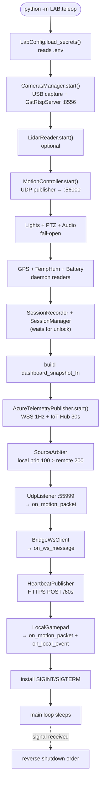

### Dispatcher shapes

`teleop.py` owns three dispatchers that fan every incoming event to the right subsystem:

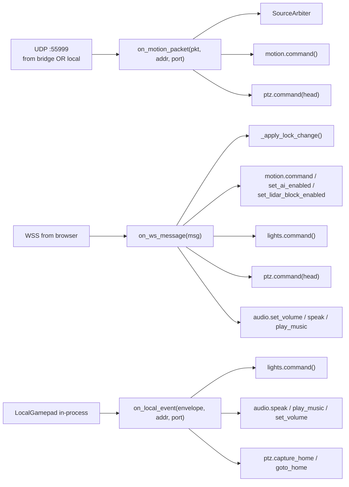

Each dispatcher is scoped to the schema of its channel. `on_motion_packet` treats the packet as trimmed motion. `on_ws_message` handles the flat browser field-per-message envelopes. `on_local_event` handles the richer `{seq, t, type, data}` envelope from the local dongle.

---

## 4. Motion Subsystem (`motion.py`)

Two sources — human (gamepad) and AI (imitation model) — arbitrated with hard human priority. Watchdog zeros velocity on silence; lidar gate is runtime-togglable.

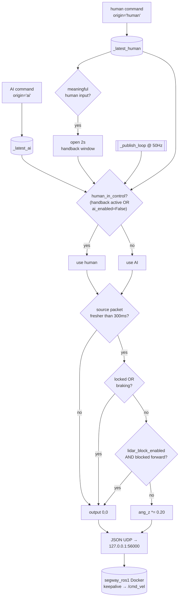

**Key behaviors:**

- **Handback window**: 2 s of "human wins" opened by any non-idle human input (>0.05 in either axis, or brake).
- **Human brake latches AI off**: physically pressing brake sets `_ai_enabled=False` until re-enabled.
- **AI auto-disable on gamepad drop**: if AI is enabled and no human packet arrives for `human_stale_timeout` (2 s), AI is auto-disabled as a safety measure.
- **Watchdog**: silence → zero velocity (brake in place). Does **not** touch `robot_lock` — lock is WS-owned.
- **Lidar gate**: only blocks forward motion (`commanded lin_x > 0` AND `front sector inside bubble`).
- **`bubble` from WS** toggles the lidar gate at runtime via `set_lidar_block_enabled()`.

---

## 5. Lights Subsystem (`lights.py`)

Physical wiring on a dcttech 4-channel USB HID relay (VID `0x16c0` PID `0x05df`):

| Channel | Load |
|---|---|
| **1** | Right taillight + right halo (shared circuit) |
| **2** | Left taillight + left halo (shared circuit) |
| **3** | Headlights + strobe (shared circuit) |
| **4** | Xmas lights (xwalk-exclusive) |

### Precedence

A single blink-loop thread arbitrates every channel by precedence (highest wins):

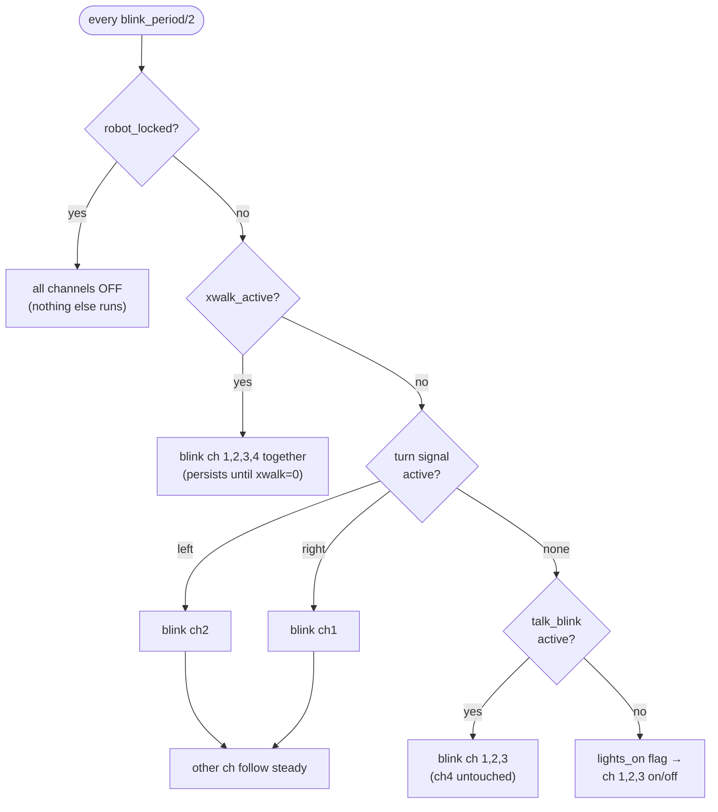

### Lock/unlock behavior

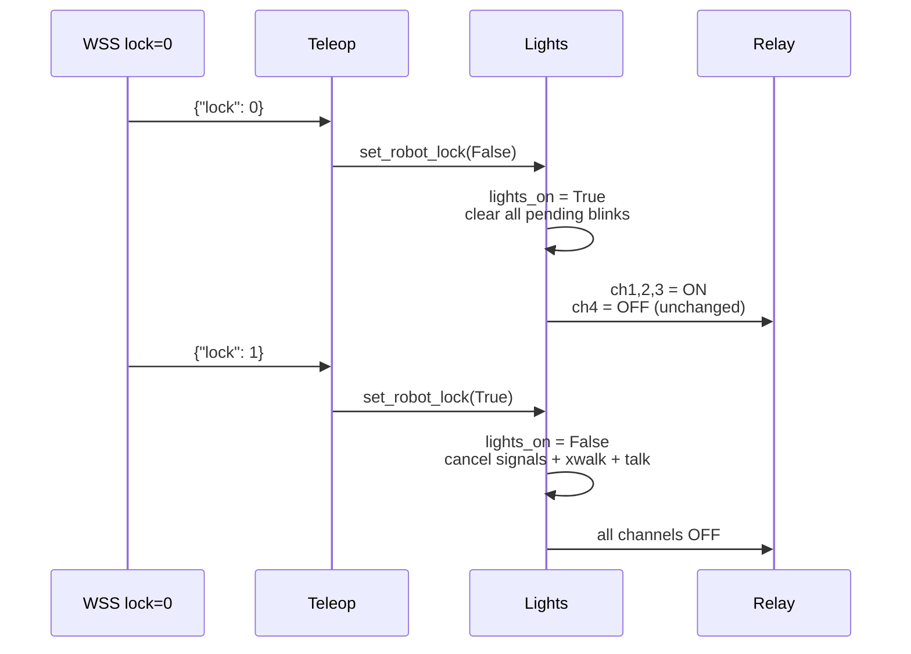

### Event handlers

- **`indicator {"side": "left"|"right"|"center"}`**: turn signal on given side self-expires after `signal_timeout_sec` (5 s). Flick same side again → cancel. Flick opposite → switch. `center` (stick release) is a no-op.
- **`xwalk {"on": true|false}`**: `on=True` starts the 4-channel blink and it persists until `on=False` explicitly turns it off. `on=False` restores the prior steady state.
- **`talk {"duration": float}`**: channels 1,2,3 blink for `duration` seconds (default 7 s), then restore steady. Xmas untouched.
- **`lights` envelope**: ignored while unlocked — lock state owns lights (prevents accidentally killing safety lights while driving).

---

## 6. PTZ Subsystem (`ptz.py`)

ONVIF continuous-move driver with dead-reckoned position tracking for capture/return-to-home.

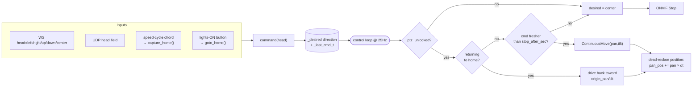

- **Independent from drivetrain lock** — the operator can look around while the robot is locked, if `ptz_unlocked=True` is set. In practice teleop mirrors the drivetrain lock.
- **Home capture triggers**: first unlock ever, explicit `capture_home()` call, or `speed_mode` change.
- **Deadband** on ONVIF re-issue prevents hammering the camera at loop rate.

---

## 7. Audio Subsystem (`audio.py`)

PulseAudio-managed. USB sink auto-selection at startup, Piper TTS in-process, music playback via `paplay`.

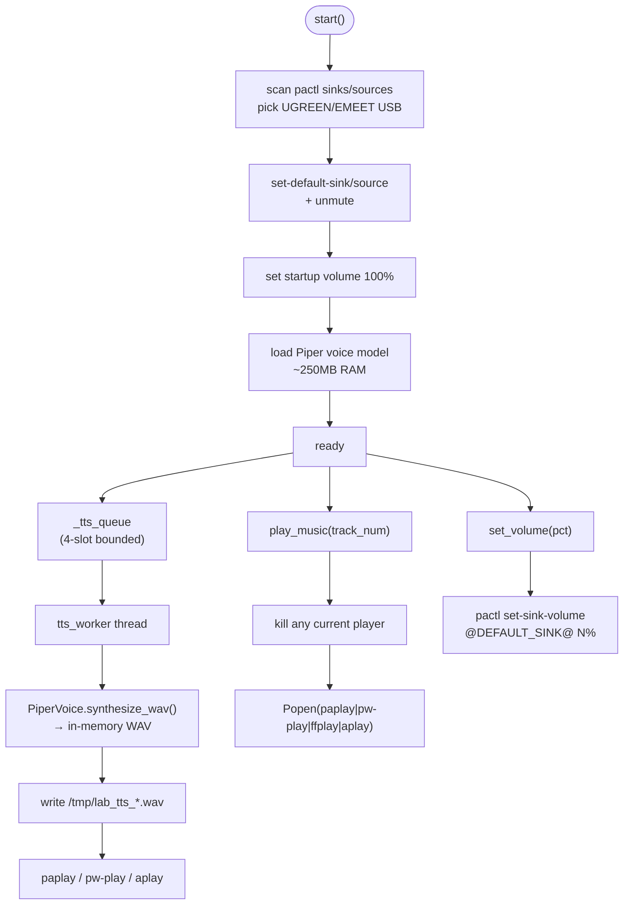

- **TTS queue drops on full** — full queue means playback is behind; silently drop rather than back-pressure the WS dispatcher.
- **Music playback replaces** — starting a new track terminates the current player subprocess.
- **Volume dedupe** upstream in teleop: the browser fires twice per slider notch, so only the changed value is applied.

---

## 8. Cameras & RTSP (`cameras.py`)

Two responsibilities merged: USB capture (single owner of `/dev/videoN`) and in-process `GstRtspServer` on port 8556.

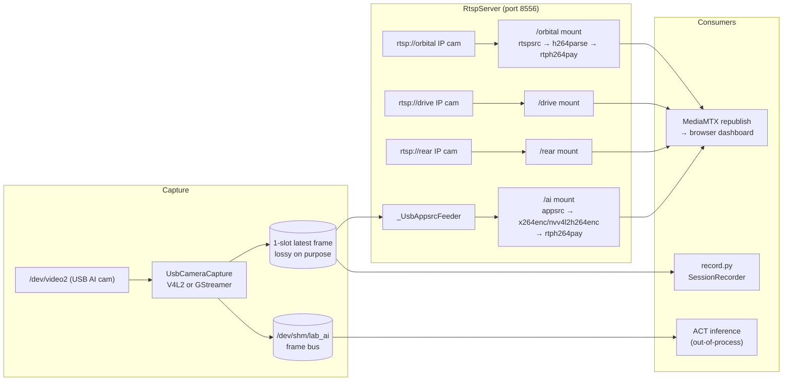

**Isolation guarantees:**

- Capture thread never blocks on any consumer. If the encoder stalls, `push-buffer` returns non-OK, the feeder drops the frame, and capture keeps running.
- Recorder reads the 1-slot latest-frame slot directly (single-process, no IPC).
- The frame bus (`/dev/shm/lab_ai`) uses a seqlock header for torn-read detection so out-of-process AI can read frames concurrently.

**Watchdog**: a background thread counts CLOSE_WAIT connections on :8556; if it exceeds threshold, `os._exit(1)` and systemd restarts teleop.

---

## 9. Sensors (`sensors.py`, `lidar.py`)

Four daemon-thread readers, all following the same `start / get / stop` shape.

```mermaid
flowchart TD
    subgraph GPS
        Mux["gps_mux.py<br/>owns /dev/um982_gps"] --> PTY["/tmp/scoutlab_gps_pty"]
        Mux --> UDP["UDP 127.0.0.1:57002"]
        PTY --> Polaris["Polaris RTK client"]
        Polaris -.->|"RTCM back"| Mux
        UDP --> GPSReader["GpsReader<br/>parses GGA/RMC/VTG/HDT/ADRNAVA"]
    end

    subgraph TempHum
        HID["PCsensor TEMPerHUM<br/>VID:PID 3553:A001"] --> Discover["scan /dev/hidraw*<br/>by VID:PID"]
        Discover --> ReadHID["send 0x01,0x80,0x33,...<br/>read 8 bytes"]
        ReadHID --> Parse["decode temp_c + rh"]
    end

    subgraph Battery
        Docker["segway_ros1 container"] --> Exec["docker exec rostopic echo /bms_fb<br/>(persistent, line-buffered)"]
        Exec --> Stream["parse YAML records<br/>separated by ---"]
        Stream --> BMS[("bat_soc / bat_charging /<br/>bat_vol / bat_current / bat_temp")]
    end

    subgraph Lidar
        Serial["/dev/rplidar_s2<br/>UART @ 1Mbps"] --> S2["_RPLidarS2<br/>SCAN mode"]
        S2 --> Points["ScanPoint[]"]
        Points --> Sectors["min distance per sector:<br/>front / left / right"]
        Sectors --> Bubble["blocked = distance < bubble_m"]
    end
```

- **All readers publish to an internal snapshot dict** returned by `get()`. Every snapshot includes an age; consumers decide staleness.
- **Battery uses a persistent `docker exec`** instead of per-poll subprocess spawn, avoiding rostopic startup overhead per poll.
- **Lidar sector geometry**: front `[-45°, +45°]`, left `[45°, 135°]`, right `[-135°, -45°]`. Bubble default 10 cm.
- **`is_blocked_forward(lin_x)`** returns True only if commanded forward AND front sector fresh AND inside bubble — the exact signature `motion.py` calls.

---

## 10. Session Recording (`record.py`)

Every unlock → lock cycle produces one folder under `~/.cache/scout/lab/`.

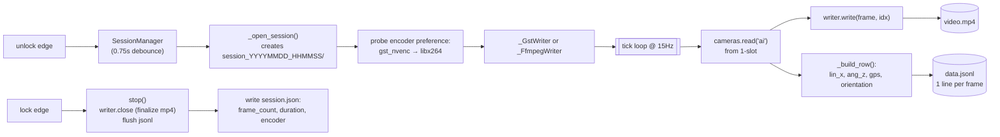

**Encoder backends** (in preference order):

- **`gst_nvenc`**: GStreamer pipeline with `nvv4l2h264enc` (Jetson hardware encoder). `appsrc → videoconvert → nvvidconv → nvv4l2h264enc → h264parse → mp4mux → filesink`.
- **`libx264`**: ffmpeg subprocess CPU fallback with `ultrafast/zerolatency`.

Both produce identical MP4 + JSONL + session.json layouts. Output is ~700 MB/hr at 1500 kbps.

### Recording pipeline (data flow)

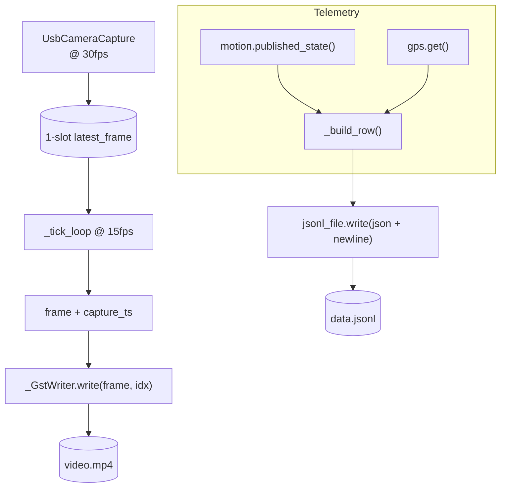

---

## 11. Azure Telemetry (`azure_telemetry.py`)

Two independent cadences from one snapshot function:

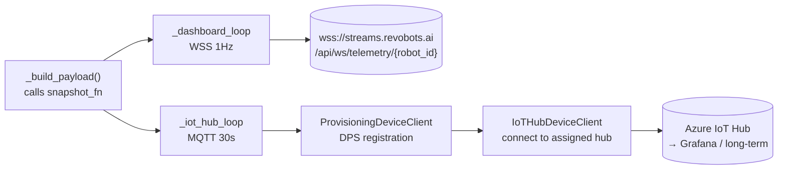

The snapshot function is assembled in `teleop.main()` from the live subsystem handles and includes: `speed_pct`, `speed_mode`, `robot_battery_pct`, `box_temp_F`, `cpu_temp_F`, `humidity_pct`, `gps_lat`, `gps_lng`, `gps_alt`, `gps_orient`, `gps_fix`, `up_time`, `fake:false`. CPU temp is read directly from `/sys/class/thermal/thermal_zone*`.

Missing sensor values are simply absent from the payload rather than sent as nulls. IoT Hub is skipped cleanly if the DPS secrets aren't in `.env`.

---

## 12. AI / Imitation Learning Integration

Human-AI shared motion arbitration is built into `motion.py` and enabled by the browser's `AI` field or the local gamepad's dual-trigger chord.

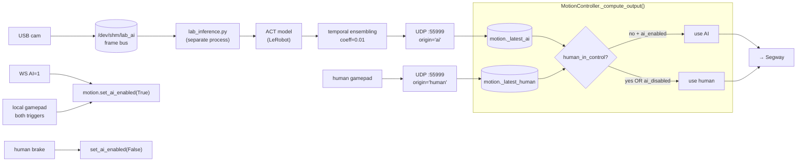

The inference process is separate from teleop and reads frames from the shared-memory frame bus. It sends motion packets tagged `origin="ai"` to the same UDP :55999 port teleop listens on — no special channel. The arbiter in `motion.py` handles priority.

---

## 13. WSS Fleet Relay (`bridge_ws.py`)

The robot connects **out** to the fleet relay as a client. The fleet enforces singleton — only one WS per `robot_id` at a time.

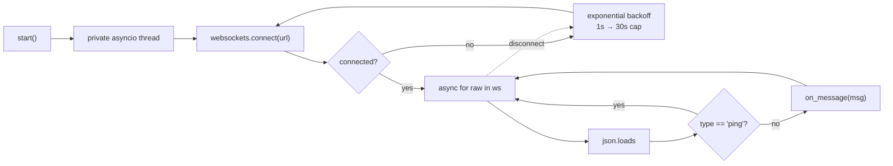

Ping frames from the relay (relay heartbeats, not browser events) are filtered out. Every other JSON dict is handed to the teleop-supplied `on_message` callback.

---

## 14. Heartbeat (`heartbeat.py`)

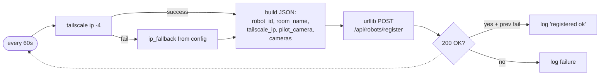

Without heartbeat POSTs, the fleet dashboard doesn't know the robot exists and the browser can't establish the WS control connection.

---

## 15. Local Gamepad (`local_gamepad.py`)

Physical 8bitdo dongle plugged into the robot. Reads via pygame/SDL, dispatches directly to teleop callbacks in-process — no sockets.

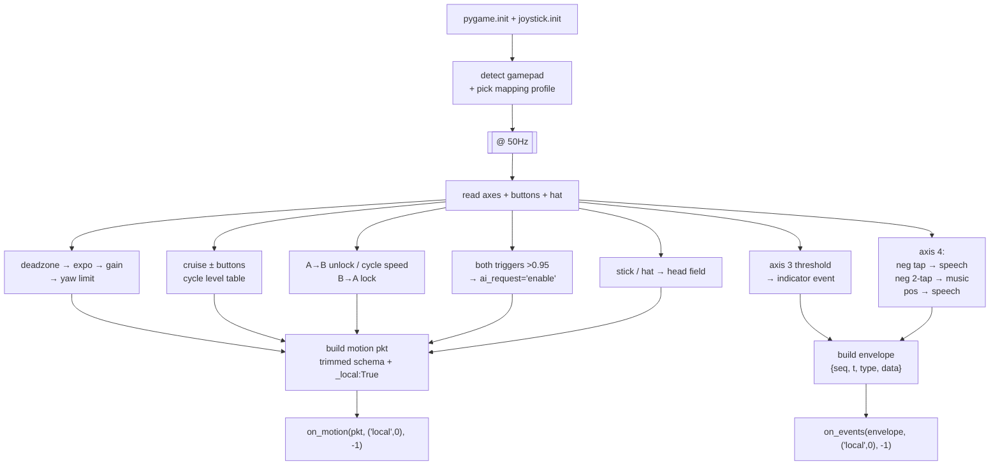

Wire-equivalent to the pilot bridge (same schemas, same state machines) but never touches a socket. The source arbiter in teleop sees `_local=True` and picks it over the remote source when both are active.

---

## 16. Startup / Shutdown Order

**Startup (in `teleop.main()`):**

1. `LabConfig.load_secrets()` from `.env`
2. `CamerasManager` — starts GstRtspServer, opens USB AI camera
3. `LidarReader` (optional) — starts polling thread
4. `MotionController` — starts UDP publisher, wires lidar block_fn
5. `LightsController`, `PtzController`, `AudioController` — fail-open
6. `GpsReader`, `TempHumReader`, `BatteryReader` — daemon readers
7. `SessionRecorder` created (not started; waits for unlock)
8. `SessionManager` thread — debounces lock edges
9. Dashboard snapshot function assembled; preview printed after 3 s
10. `AzureTelemetryPublisher` — WSS + IoT Hub loops
11. UDP flow trackers created (`remote (bridge)`, `local dongle`)
12. `SourceArbiter` (local prio 100 wins over remote 200)
13. `lock_state["locked"] = True`
14. `UdpListener` on :55999
15. `BridgeWsClient` — connects to fleet WS
16. `HeartbeatPublisher` — POSTs every 60 s
17. `LocalGamepad` — polls physical dongle
18. `SIGINT/SIGTERM` handlers installed
19. Main loop sleeps until signaled

**Shutdown reverses** the order: session_mgr → UDP flow trackers → udp_motion → bridge_ws → heartbeat → local → azure_tel → ptz → lights → audio → motion → gps → temphum → battery → lidar → cameras.

---

## 17. Wire Schemas

### WSS event schema (browser → robot)

Envelope on every message: `{"seq": N, "t": unix_int, "brain": "HI", "<field>": <value>}`. Only the changed field is sent per message.

| Field | Type | Effect |
|---|---|---|
| `lock` | 0/1 | WS-authoritative. Unlock triggers recorder start + auto-on ch1,2,3. Lock stops recorder + all off. |
| `lin_x` | float | Optional drive over WS (usually UDP). |
| `ang_z` | float | Same. |
| `head` | string | `left / right / up / down / center` → PTZ. |
| `speed_mode` | string | `slow / medium / fast` — telemetry passthrough + triggers `ptz.capture_home()`. |
| `AI` | 0/1 | `motion.set_ai_enabled(bool)`. |
| `bubble` | 0/1 | `motion.set_lidar_block_enabled(bool)`. |
| `xwalk` | 0/1 | 4-channel blink (ch1-3 + xmas); persists until 0. |
| `yield` | 0/1 | Log only (subsystem TBD). |
| `left_turn` | 0/1 | `lights` indicator envelope, side=left. |
| `right_turn` | 0/1 | Same, right. |
| `volume` | 0..100 | `audio.set_volume(int)`. Deduped. |
| `tts` | string | `text: <words>` = speech; `track: <file>.wav` = music; free-form = speech. |
| `ttd` | string | `img: <file>.png` or free-form — log only (no display subsystem). |

### UDP motion schema (:55999)

Trimmed payload — `lock` is NOT in this packet:

```json
{"seq": N, "t": unix, "brain": "HI",
 "lin_x": float, "ang_z": float, "brake": float, "head": "left|..."}
```

Local dongle adds richer fields: `robot_lock`, `speed`, `lift`, `ai_request`, `priority`, `origin`, `_local: true`.

### Heartbeat schema (HTTPS POST /api/robots/register)

```json
{"robot_id": "iwu-scout-001",
 "room_name": "iwu-scout-001",
 "tailscale_ip": "100.109.21.91",
 "pilot_camera": "iwu-scout-001-drive",
 "cameras": ["iwu-scout-001-orbital", "iwu-scout-001-drive",
             "iwu-scout-001-rear", "iwu-scout-001-ai",
             "iwu-scout-001-floor"]}
```

### Local dongle event envelope (in-process)

TCP-shape envelope for richer control events:

```json
{"seq": N, "t": unix,
 "type": "lights|indicator|talk|audio|music|ptz",
 "data": { ... type-specific ... }}
```

Kept separate from the WSS flat schema because it carries data the browser doesn't (talk duration, music track number, indicator side, PTZ actions).

### Telemetry snapshot (WSS 1 Hz + IoT Hub 30 s)

```json
{"robot_id": "...", "ts": 1720000000.0,
 "robot_battery_pct": 87.0, "speed_pct": 12.3, "speed_mode": "slow",
 "box_temp_F": 82.0, "cpu_temp_F": 108.2, "humidity_pct": 44.0,
 "gps_lat": 41.6764, "gps_lng": -86.2520, "gps_alt": 226.4,
 "gps_orient": 178.3, "gps_fix": "RTK_FIXED",
 "up_time": "01:23", "fake": false}
```

---

## 18. How to Run

### On the robot

Direct:
```bash
cd ~/aditya/aadi_scout_hw
python3 -m LAB.teleop
```

Under systemd (recommended) — `ros_start.sh` brings up the Segway Docker stack first then execs teleop, and tears everything down on SIGTERM:
```bash
systemctl start aadi_ros_start_teleop.service
```

GPS + RTK:
```bash
systemctl start aadi_gps_rtk.service   # runs LAB/utils/gps_rtk.sh
```

### On the operator PC

```bash
cd LAB/pilot
python pilot_bridge.py                    # default WS port 8765
python pilot_bridge.py --list-devices     # detect gamepads
python pilot_bridge.py --no-udp           # WS pad state only, no motion UDP
```

Open `streams.revobots.ai` in Chrome. Dashboard connects to `ws://127.0.0.1:8765` for pad state and to the fleet relay for control.

---

## 19. Dependencies

**Robot:** `pygame`, `websockets>=12`, `gstreamer` + `python3-gi`, `opencv-python`, `paho-mqtt`, `azure-iot-device`, `piper-tts` (optional), `pyserial`, `onvif-zeep`, Docker with `segway_ros1` image, Tailscale, Polaris RTK binary + shared libraries.

**Operator PC:** `pygame>=2.5.0`, `websockets>=12.0`, `evdev` (Linux only, optional).

**Cloud (out of scope):** `streams.revobots.ai` fleet relay + browser dashboard.

---

## 20. File Header Convention

Every Python file starts with:

```python
# -*- coding: utf-8 -*-
"""
Created on Wed Jun  3 20:04:03 2026

@author: Aadi
"""
from __future__ import annotations
```

---

## 21. Contact

- **LAB code**: Aadi (Aditya Raj) — GitHub `Aadi0032007`, portfolio `aadi-me.vercel.app`.
- **Fleet relay / browser dashboard / message schema**: Giby Raphael (team lead).